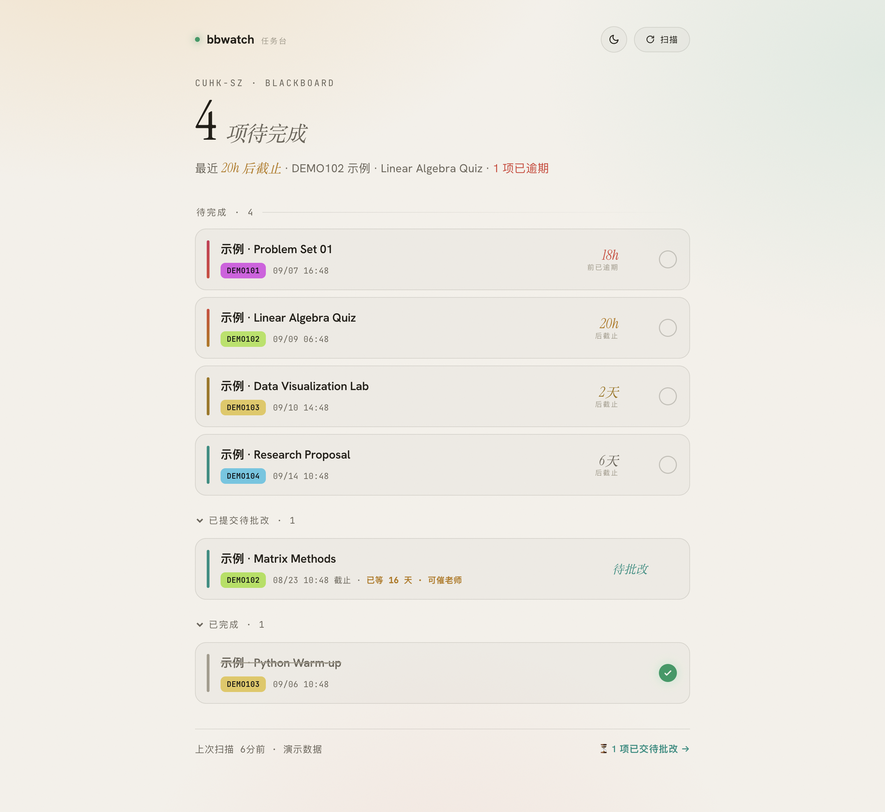

<div align="center">

# bbwatch

**你的 Blackboard 作业与课件助手**

查作业、看 ddl、找更新、下课件。<br>
在 Codex 或 Claude Code 里说一句话，就能把学校的事理清楚。

[](pyproject.toml)
[](CODEX.md)
[](INSTALL.md)
[](LICENSE)

适用于 **香港中文大学（深圳）· CUHK-SZ** 的 [Blackboard](https://bb.cuhk.edu.cn)。

[开始安装](#quick-start) · [怎么使用](#usage) · [任务看板](#dashboard) · [常见问题](#faq)

</div>

---

老师发布作业、调整截止时间或上传课件，你不一定会收到邮件。bbwatch 把这些变化整理成任务清单，也能按课程批量下载资料，帮你少翻几个页面。

<picture>
  <source media="(prefers-color-scheme: dark)" srcset="docs/assets/dashboard-dark.png">
  <source media="(prefers-color-scheme: light)" srcset="docs/assets/dashboard-light.png">
  
</picture>

<p align="center"><sub>真实界面 · 演示数据 · 支持日间与夜间主题</sub></p>

## 一眼看懂：它能帮你做什么

| 你想做的事 | bbwatch 帮你处理 |
| :--- | :--- |
| **别漏作业** | 按截止时间整理清单，高亮临近截止与逾期任务 |
| **看看有没有更新** | 扫描新作业、改期、公告、出分和新课件，支持 macOS 桌面通知 |
| **整门课一起下载** | 保留课程与文件夹结构，增量下载，识别到的往年卷归入 `_exams/` |
| **跟进待批改作业** | 单独列出已提交但尚未出分的作业 |
| **整理学习进度** | 在对话或网页看板中标记完成，也能撤销 |
| **找回下载过的资料** | 按课程、文件名或路径关键词检索本地下载记录 |

<a id="quick-start"></a>

## 开始安装

先选你正在用的客户端。两种版本共用 Python 引擎，也能复用本机已有的账号与任务数据。

| | Codex | Claude Code |
| :--- | :--- | :--- |
| **使用位置** | Codex 桌面应用 / CLI | Claude Code |
| **安装方式** | 运行全局安装器 | 从插件市场安装 |
| **刷新方式** | 按需扫描；定时监控需明确开启 | 会话开始时显示摘要，数据较旧时后台刷新 |
| **完整指南** | [Codex 安装与排障 →](CODEX.md) | [Claude Code 安装与排障 →](INSTALL.md) |

> **运行环境：** Python **3.11 或更新版本**。Codex 本机版已在 macOS 验证；Claude Code 的安装脚本面向 macOS / Linux。Windows 暂无原生安装器。
>
> 这里的 Codex 插件用于 **Codex 应用**；ChatGPT 网页版需要额外的远程接入，不是同一种安装方式。

### 用 Codex：安装一次，所有项目可用

先确认 `python3 --version` 不低于 3.11，并且能运行 `codex plugin --help`，再在终端执行：

```bash
git clone https://github.com/jsyzlbw/bbwatch.git
cd bbwatch
python3 scripts/install_codex.py
```

如果你的新版 Python 命令叫 `python3.12`，把上面的 `python3` 换成 `python3.12`。

首次配置学校账号，在**本机终端**运行：

```bash
~/.local/bin/bbwatch setup    # 按提示输入账号与密码，密码不回显
~/.local/bin/bbwatch whoami   # 验证学校登录
~/.local/bin/bbwatch scan     # 首次扫描，建立本地任务清单
```

已有 bbwatch 账号配置时可以跳过 `setup`。安装完成后，**新建一个 Codex 任务**，直接开始对话。

### 用 Claude Code：让 AI 帮你安装

把这句话发给 Claude Code：

> 请按这个仓库的 INSTALL.md 帮我安装 bbwatch 插件：https://github.com/jsyzlbw/bbwatch 。安装后请给我在本机终端配置账号的命令。

账号与密码在本机终端输入即可，**无需发到聊天中**。手动安装、首次扫描及排障见 [Claude Code 完整指南](INSTALL.md)。完成后新开一个会话。

<a id="usage"></a>

## 怎么使用：直接说你想做什么

安装并完成首次扫描后，可以这样问：

| 直接对 AI 说 | 用途 |
| :--- | :--- |
| “我还有什么作业和 ddl？” | 查看当前任务清单 |
| “扫一下，看看有没有新作业或者出分。” | 实时刷新 Blackboard 更新 |
| “哪些作业交了还没出分？” | 查看待批改作业 |
| “把 MAT3007 的课件都下载下来。” | 批量下载指定课程的资料 |
| “第 1 个作业我做完了。” | 标记当前列表中的任务完成 |
| “第 1 个还没做完，帮我撤销。” | 恢复为未完成 |
| “查找我下载过的 slides。” | 检索本机下载记录 |

**一个对话示例**（下方内容为演示）：

> **你：** 我还有什么作业？
>
> **bbwatch：** 目前有 2 项待完成：
> - **MAT3007 · Homework 2** — 明晚 23:59 截止
> - **CSC3001 · Lab 1** — 周五 18:00 截止
>
> **你：** 把 MAT3007 的课件也下载下来。
>
> **bbwatch：** 已下载到本机的 `~/Downloads/bbwatch/`，按课程和文件夹整理好了。

查询清单通常读取**本地缓存**；想要最新状态时，说“扫描一下”。截止时间按北京时间（UTC+8）展示。勾选完成只更新本地清单，实际提交仍需在 Blackboard 完成。

Claude Code 另有快捷命令：`/bb-scan`、`/bb-tasks`、`/bb-download`、`/bb-setup`。

<a id="dashboard"></a>

## 任务看板：打开浏览器，一起看清楚

Codex 全局安装后，在终端运行：

```bash
~/.local/bin/bbwatch dashboard
```

按终端提示打开本机地址，默认是 **http://127.0.0.1:8765/**。看板支持：

- 按截止时间浏览任务，快速识别逾期与临近截止的作业。
- 勾选完成、撤销完成，切换日间 / 夜间主题。
- 点击“立即扫描”，手动刷新 Blackboard 数据。

看板运行在本机。保持终端窗口开启，退出时按 **Ctrl+C**。Claude Code 用户使用安装指南中实际引擎路径下的 `bbwatch` 命令。

<a id="faq"></a>

## 常见问题

<details>
<summary><strong>装好后，为什么还看不到作业？</strong></summary>

安装只准备运行环境。你还需要配置学校账号，并完成第一次扫描。空缓存不代表 Blackboard 上没有作业。Codex 用户可先运行 `~/.local/bin/bbwatch whoami` 验证登录，再运行 `~/.local/bin/bbwatch scan`。

</details>

<details>
<summary><strong>它会一直在后台扫描吗？</strong></summary>

Codex 版默认按需运行，安装时不创建定时任务。Claude Code 版保留原有会话钩子：打开会话时展示摘要，从未扫描或距上次扫描超过两小时时尝试后台刷新。两种版本的行为分别写在各自安装指南中。

</details>

<details>
<summary><strong>账号、任务和课件放在哪里？</strong></summary>

macOS 上，账号凭据由本机钥匙串保存；登录时通过学校认证系统使用。任务数据库、会话与配置默认保存在 `~/.bbwatch`，课件默认下载到 `~/Downloads/bbwatch/`。配置可以修改下载目录。

对话查询的课程与任务内容会作为工具结果提供给你正在使用的 AI 客户端。密码不需要发送到聊天中，也不应写入仓库。

</details>

<details>
<summary><strong>我已经装了 Claude Code 版，还要重新配置吗？</strong></summary>

通常不需要。两个客户端使用同一个钥匙串服务和默认数据目录。Codex 安装器独立管理自己的运行环境，已有的任务记录与凭据会保留。安装后新建 Codex 任务即可加载插件。

</details>

<details>
<summary><strong>学校改了密码，或者提示登录失败怎么办？</strong></summary>

在本机终端重新运行 `bbwatch setup` 更新凭据，再用 `bbwatch whoami` 验证。运行 `bbwatch doctor` 可以检查本地配置。命令的完整路径见你所用版本的安装指南。

</details>

<details>
<summary><strong>下载和“标记完成”会影响 Blackboard 吗？</strong></summary>

下载会把你账号可访问的课程附件保存到本机；“标记完成”记录的是本地学习进度。作业提交与成绩管理仍在 Blackboard 中进行。课件请遵守课程的使用与分发要求。

</details>

## 命令速查

下面用 `bbwatch` 表示命令入口。Codex 用户可以写成 `~/.local/bin/bbwatch`；Claude Code 用户的完整路径见 [安装指南](INSTALL.md)。

| 命令 | 作用 |
| :--- | :--- |
| `bbwatch setup` / `bbwatch whoami` | 配置账号 / 验证登录 |
| `bbwatch scan` | 扫描课程更新，支持 macOS 桌面通知 |
| `bbwatch tasks` / `bbwatch pending` | 查看任务 / 查看待批改作业 |
| `bbwatch done N` / `bbwatch undone N` | 将第 N 项标记完成 / 撤销 |
| `bbwatch courses` | 查看在读课程 |
| `bbwatch download MAT3007` | 下载指定课程的课件 |
| `bbwatch find slides` | 按路径关键词查找已下载文件 |
| `bbwatch dashboard` | 启动网页任务看板 |
| `bbwatch config` / `bbwatch doctor` | 查看配置 / 本地自检 |

## 给开发者

Python 引擎负责学校登录、数据抓取、SQLite 变化比对与增量下载；MCP 接口把这些能力提供给 AI 客户端。

```bash
git clone https://github.com/jsyzlbw/bbwatch.git
cd bbwatch
python3 -m venv .venv
.venv/bin/python -m pip install -e '.[dev]'
PYTHONPATH=src .venv/bin/python -m pytest -q
```

| 目录 | 内容 |
| :--- | :--- |
| [`src/bbwatch/`](src/bbwatch/) | Python 引擎、MCP 接口与网页看板 |
| [`plugins/bbwatch/`](plugins/bbwatch/) | Codex 插件与中文使用技能 |
| [`.claude-plugin/`](.claude-plugin/) | Claude Code 插件定义 |
| [`tests/`](tests/) | 单元测试、安装测试与 MCP 协议测试 |
| [`docs/superpowers/`](docs/superpowers/) | 设计文档与实现计划 |

后续方向：邮件 / Telegram 通知渠道、Windows 原生支持。欢迎通过 [Issues](https://github.com/jsyzlbw/bbwatch/issues) 反馈问题或提交改进。

---

<div align="center">

[MIT License](LICENSE) · 为 CUHK-SZ 的学习日常做一点减法。

</div>
