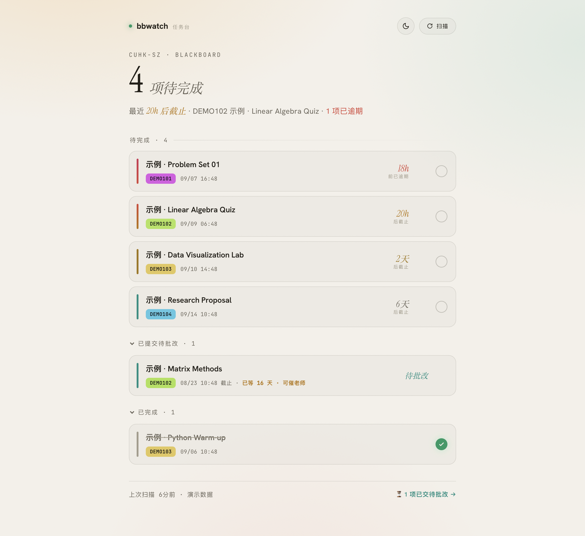
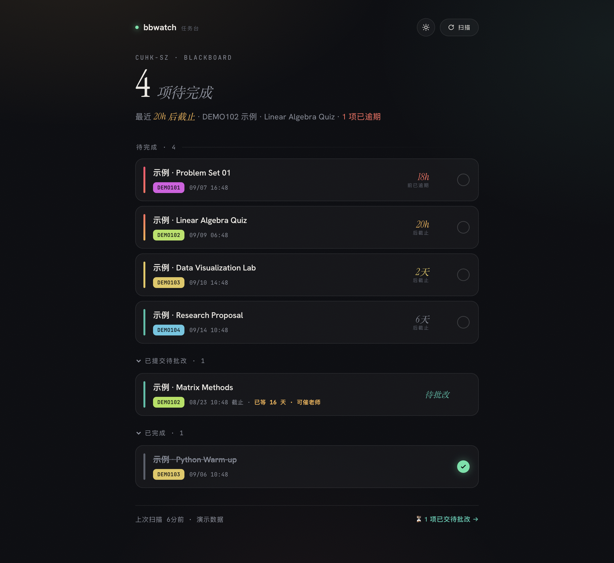

<div align="center">

# bbwatch

### 少翻几个页面，把作业、DDL 和课件放在一起。

为 **香港中文大学（深圳）· CUHK-SZ** 打造的 Blackboard 助手。<br>
在 Codex / Claude Code 里直接对话，也可以使用命令行与本机网页看板。

[](pyproject.toml)
[](CODEX.md)
[](INSTALL.md)
[](#windows-cli)
[](LICENSE)

[快速开始](#quick-start) · [对话示例](#usage) · [任务看板](#dashboard) · [命令速查](#commands) · [常见问题](#faq)

</div>

---

老师发布作业、调整截止时间或上传课件，你不一定会收到邮件。bbwatch 把 [Blackboard](https://bb.cuhk.edu.cn) 上的变化整理成一份本地清单，让你更容易知道：**接下来做什么、什么有更新、资料放在哪。**

## 能帮你做什么

| | 能力 | 日常用法 |
| :---: | :--- | :--- |
| 📅 | **作业与截止时间** | 按截止时间整理任务，突出临近截止与逾期项 |
| 🔎 | **课程变化追踪** | 扫描新作业、改期、公告、出分与新课件；macOS 支持桌面通知 |
| 📚 | **课件增量下载** | 按课程与文件夹整理附件，识别到的往年卷归入 `_exams/` |
| ⏳ | **待批改清单** | 单独查看已提交但尚未出分的作业 |
| ✅ | **本地学习进度** | 在对话或看板中标记完成、撤销，隐藏的任务也能恢复 |
| 🗂️ | **已下载资料检索** | 按课程、文件名或路径关键词查找本地下载记录 |

> **使用边界：** 查询通常读取本地缓存，想获取最新状态请先扫描。截止时间按北京时间（UTC+8）展示；标记完成只更新本地清单，**实际提交仍需在 Blackboard 完成**。

<a id="quick-start"></a>

## 快速开始

准备好 **Git、Python 3.11+ 和学校 Blackboard 账号**，再选择适合你的入口：

| 你的环境 | 推荐入口 | 安装后如何使用 |
| :--- | :--- | :--- |
| **macOS + Codex** | [全局插件安装](#codex-install) | 所有 Codex 项目中直接对话，默认按需扫描 |
| **Windows 10/11** | [原生命令行](#windows-cli) | 不依赖 WSL；终端命令 + 网页看板 |
| **macOS / Linux + Claude Code** | [插件市场安装](#claude-install) | 新会话展示摘要，数据较旧时后台刷新 |
| **macOS / Linux，只用终端** | [独立 CLI 安装指南](INSTALL.md#macos--linux) | 无需安装 AI 客户端 |

<a id="codex-install"></a>

### macOS · Codex

确认 `python3 --version` 为 **3.11+**，且 `codex plugin --help` 能正常运行。即使使用 Codex 桌面应用，安装时也需要 Codex CLI。

```bash
git clone https://github.com/jsyzlbw/bbwatch.git
cd bbwatch
python3 scripts/install_codex.py
```

在**本机终端**依次完成账号配置、登录验证与首次扫描：

```bash
~/.local/bin/bbwatch setup
~/.local/bin/bbwatch whoami
~/.local/bin/bbwatch scan
```

然后**新建一个 Codex 任务**，说“我还有什么作业和 DDL？”即可。已有 bbwatch 凭据时通常可以跳过 `setup`。

<details>
<summary>Python 版本、安装检查与完整说明</summary>

如果新版 Python 的命令是 `python3.12`，将安装命令中的 `python3` 换成它。可以先运行 `python3 scripts/install_codex.py --dry-run` 查看检查结果与安装位置。

安装器不会登录学校、扫描课程或创建定时任务。这里安装的是 **Codex 本机插件**，不是 ChatGPT 网页版的远程接入。

完整步骤、安装路径及移除方式见 [Codex 安装指南](CODEX.md)。

</details>

<a id="windows-cli"></a>
<a id="windows-1011只安装原生-cli"></a>

### Windows 10/11 · 原生 CLI

在 PowerShell 中运行；请先确认 `py --version` 为 **3.11+**：

```powershell
git clone https://github.com/jsyzlbw/bbwatch.git
cd bbwatch
py scripts/install_codex.py --cli-only
```

安装器会把命令目录加入当前用户 PATH。**新开一个 PowerShell 窗口**，再运行：

```powershell
bbwatch setup
bbwatch whoami
bbwatch scan
bbwatch tasks
bbwatch dashboard
```

**当前支持范围：** CLI 与本机看板不要求 Codex，也不使用 WSL。安装器会打印 MCP 启动命令，但不会自动配置 Codex、Claude Code 或 Cursor；Windows Claude Code hooks、Windows Toast 与完整 Codex 插件注册暂未提供。

<details>
<summary>解释器选择、Windows 路径与验证说明</summary>

安装器本身必须由 Python 3.11+ 启动；版本过低时会停止并提示。也可以使用已安装的新版解释器启动，例如 `py -3.12 scripts/install_codex.py --cli-only`。`--python <python.exe 路径>` 可指定运行环境使用的解释器。

| 内容 | 位置 |
| :--- | :--- |
| 用户数据 | `%USERPROFILE%\.bbwatch` |
| Python 运行环境 | `%LOCALAPPDATA%\bbwatch\runtime\venv` |
| 默认下载目录 | `%USERPROFILE%\Downloads\bbwatch` |
| 凭据 | Windows Credential Manager（通过 `keyring`） |

首次登录、扫描与下载仍需在你的 Windows 网络和 Blackboard 账号环境中验证。详见 [Windows CLI 说明](CODEX.md#windows-1011-原生-cli)。

</details>

<a id="claude-install"></a>

### macOS / Linux · Claude Code

把下面这段话发给 Claude Code：

> 请按 https://github.com/jsyzlbw/bbwatch 的 INSTALL.md 为当前用户安装 bbwatch。完成安装与初始化后，给我完整的本机终端命令，用于配置账号、验证登录和首次扫描；账号密码由我在终端输入。

完成后**新开一个 Claude Code 会话**。它会先展示本地摘要；从未扫描或距上次扫描超过两小时时，会尝试后台刷新，摘要可能仍是刷新前的数据。

想自己安装？查看 [Claude Code 完整指南](INSTALL.md)，其中包含插件市场命令、实际引擎路径与 Linux 密钥环排障。

> **账号安全：** 密码只需在本机终端输入，输入时不回显。无需发进聊天，也不要写入仓库。

<a id="usage"></a>

## 对话示例

配置好 AI 客户端并完成首次扫描后，直接说你想做什么：

| 对 AI 说 | 对应操作 |
| :--- | :--- |
| “我还有什么作业和 DDL？” | 查看本地任务清单 |
| “扫一下，看看有没有新作业或者出分。” | 实时扫描课程更新 |
| “哪些作业交了还没出分？” | 查看待批改作业 |
| “把 MAT3007 的课件都下载下来。” | 增量下载指定课程资料 |
| “第 1 个作业做完了。” / “撤销第 1 个的完成状态。” | 更新本地完成记录 |
| “查找我下载过的 slides。” | 检索本地下载记录 |

<details>
<summary>展开一段示例对话</summary>

以下为演示内容，课程与任务不代表你的实际数据。

> **你：** 我还有什么作业？
>
> **bbwatch：** 目前有 2 项待完成：
> - **MAT3007 · Homework 2** — 明晚 23:59 截止
> - **CSC3001 · Lab 1** — 周五 18:00 截止
>
> **你：** 把 MAT3007 的课件也下载下来。
>
> **bbwatch：** 已下载到本机的 `~/Downloads/bbwatch/`，按课程和文件夹整理好了。

</details>

Claude Code 还支持快捷命令：`/bb-scan`、`/bb-tasks`、`/bb-download`、`/bb-setup`。

<a id="dashboard"></a>

## 任务看板

**学习，有条不紊。** 把下一项截止、待完成、待批改与已完成放在同一个页面，支持日间 / 夜间主题与小屏幕布局。

<table>
  <tr>
    <th width="50%">日间 · Light</th>
    <th width="50%">夜间 · Dark</th>
  </tr>
  <tr>
    <td><a href="docs/assets/dashboard-light.png"></a></td>
    <td><a href="docs/assets/dashboard-dark.png"></a></td>
  </tr>
</table>

<p align="center"><sub>真实界面 · 演示数据 · 点击图片查看大图</sub></p>

启动方式：

```bash
# macOS · Codex 全局安装
~/.local/bin/bbwatch dashboard
```

Windows CLI 用户运行 `bbwatch dashboard`；Claude Code 用户使用[实际引擎路径下的命令](INSTALL.md#网页看板)。打开终端提示的本机地址，默认是 **http://127.0.0.1:8765/**，保持终端开启，退出时按 **Ctrl+C**。

- **看清进度：** 标记或撤销完成，展开待批改 / 已完成 / 已隐藏分组，隐藏任务可恢复。
- **主动更新：** 点击“扫描更新”查看进度与结果；课程较多时可能需要几分钟。
- **出错可恢复：** 扫描失败或部分完成时保留具体提示；断线时保留已载入清单，可点击“重新连接”。
- **缓存刷新：** 页面可见时每分钟重读本地清单，不会因此扫描 Blackboard。

<a id="commands"></a>

## 命令速查

下表以 `bbwatch` 表示入口：macOS Codex 用户可用 `~/.local/bin/bbwatch`，Windows CLI 用户直接使用 `bbwatch`；其他安装方式请使用对应环境中的完整路径。

| 命令 | 作用 |
| :--- | :--- |
| `bbwatch setup` / `bbwatch whoami` | 配置账号 / 验证学校登录 |
| `bbwatch scan` | 扫描课程更新 |
| `bbwatch tasks` / `bbwatch pending` | 查看任务 / 查看待批改作业 |
| `bbwatch done N` / `bbwatch undone N` | 标记第 N 项完成 / 撤销；先用 `tasks` 确认编号 |
| `bbwatch courses` | 查看在读课程及编号 |
| `bbwatch download MAT3007` | 下载课程代码匹配的资料，也可使用课程编号 |
| `bbwatch find slides` | 按关键词检索本地下载记录 |
| `bbwatch dashboard` | 启动网页看板；可用 `--port 8766` 更换端口 |
| `bbwatch config` / `bbwatch doctor` | 查看配置 / 本地自检 |

<a id="faq"></a>

## 常见问题

<details>
<summary><strong>安装成功了，为什么没有作业？</strong></summary>

安装只准备运行环境。先用 `bbwatch setup` 配置账号，再用 `bbwatch whoami` 验证登录，最后运行 `bbwatch scan`。空缓存不代表 Blackboard 上没有作业；请使用你的安装方式对应的命令路径。

</details>

<details>
<summary><strong>账号、任务和课件保存在哪里？</strong></summary>

凭据通过 `keyring` 保存：macOS 使用钥匙串，Windows 使用 Credential Manager，Linux 需要可用的系统密钥环。任务数据库、会话与配置默认位于用户主目录的 `.bbwatch`，课件默认下载到 `Downloads/bbwatch`；下载目录可以配置。

课程和任务内容在对话查询时会作为工具结果提供给你使用的 AI 客户端。密码无需发送到聊天中。下载的课件请遵守课程使用与分发要求。

</details>

<details>
<summary><strong>它会一直在后台扫描吗？</strong></summary>

Codex 默认按需运行，安装时不创建定时任务。Claude Code 在新会话中展示摘要，并在从未扫描或缓存超过两小时时尝试后台刷新。CLI 只在执行命令时工作；看板定期读取缓存，不等于定时扫描学校网站。

</details>

<details>
<summary><strong>学校改了密码，或者登录失败怎么办？</strong></summary>

在本机终端重新运行 `bbwatch setup`，再用 `bbwatch whoami` 验证。连续三次账号或密码认证失败会触发一小时的本地暂停；成功保存凭据可重置暂停，但不等于新密码已验证。不要反复重试错误凭据。详见 [登录排障](CODEX.md#登录失败或提示认证连续失败已熔断)。

</details>

<details>
<summary><strong>关掉代理后还能扫描吗？</strong></summary>

配置的本机回环代理端口不可连接时，bbwatch 会尝试直连；重新打开代理后会再次检查。远程代理或已连接后的网络错误不会自动直连重试。macOS 还支持读取系统手动代理设置，暂不解析 PAC 脚本。

这不会修改其他应用的代理设置。完整规则见 [网络连接说明](CODEX.md#网络连接与代理自动切换)。

</details>

<details>
<summary><strong>扫描很慢、时间没变，或更新后仍看到旧页面？</strong></summary>

扫描完成前保留上次的数据与时间；课程较多时请等待几分钟，无需重复点击。失败或部分完成时查看提示，处理后重新扫描。旧版本页面可能需要手动刷新才能读取扫描结果。

更新并重新安装后，在原终端按 **Ctrl+C** 停止旧看板，再运行 `bbwatch dashboard` 并刷新页面。macOS Codex 更新步骤见 [更新、检查与移除](CODEX.md#更新检查与移除)；Windows CLI 在仓库中更新后重新执行 `py scripts/install_codex.py --cli-only`；Claude Code 更新插件后重新运行 `claude --init-only`。

</details>

<details>
<summary><strong>Codex 与 Claude Code 能共用数据吗？</strong></summary>

同一台机器、同一用户下，两者默认共用 `bbwatch` 密钥环服务与 `.bbwatch` 数据目录，通常无需重新配置账号。Codex 安装器独立管理运行环境，已有任务与凭据会保留；两个客户端的自动刷新行为仍然不同。

</details>

<a id="development"></a>

## 开发与贡献

Python 引擎负责学校登录、数据抓取、SQLite 变化比对与增量下载；MCP 接口将能力提供给 AI 客户端，本机看板提供可视化入口。

<details>
<summary>本地开发与测试</summary>

macOS / Linux：

```bash
git clone https://github.com/jsyzlbw/bbwatch.git
cd bbwatch
python3 -m venv .venv
.venv/bin/python -m pip install -e '.[dev]'
PYTHONPATH=src .venv/bin/python -m pytest -q
```

Windows PowerShell：

```powershell
git clone https://github.com/jsyzlbw/bbwatch.git
cd bbwatch
py -3.11 -m venv .venv
.venv\Scripts\python.exe -m pip install -e ".[dev]"
.venv\Scripts\python.exe -m pytest -q
```

Windows 示例使用 Python 3.11；若安装的是更新版本，请相应替换 `-3.11`。测试通过不等于真实学校账号与网络环境已验证。

</details>

| 路径 | 内容 |
| :--- | :--- |
| [`src/bbwatch/`](src/bbwatch/) | 引擎、MCP 接口与网页看板 |
| [`plugins/bbwatch/`](plugins/bbwatch/) | Codex 插件与中文使用技能 |
| [`.claude-plugin/`](.claude-plugin/) | Claude Code 插件定义 |
| [`scripts/`](scripts/) | 安装器与初始化脚本 |
| [`tests/`](tests/) | 单元测试、安装测试与 MCP 协议测试 |
| [`docs/superpowers/`](docs/superpowers/) | 设计文档与实现计划 |

欢迎通过 [Issues](https://github.com/jsyzlbw/bbwatch/issues) 反馈问题或提交改进。反馈时请注明系统、Python 版本、安装方式与报错，**不要附带密码、会话凭据或个人课程数据**。

后续方向：Windows Claude Code hooks、Windows Toast，以及邮件 / Telegram 通知渠道。

---

<div align="center">

**为 CUHK-SZ 的学习日常做一点减法。**<br>
[MIT License](LICENSE) · [Codex 安装指南](CODEX.md) · [Claude Code 安装指南](INSTALL.md) · [回到顶部](#bbwatch)

</div>
